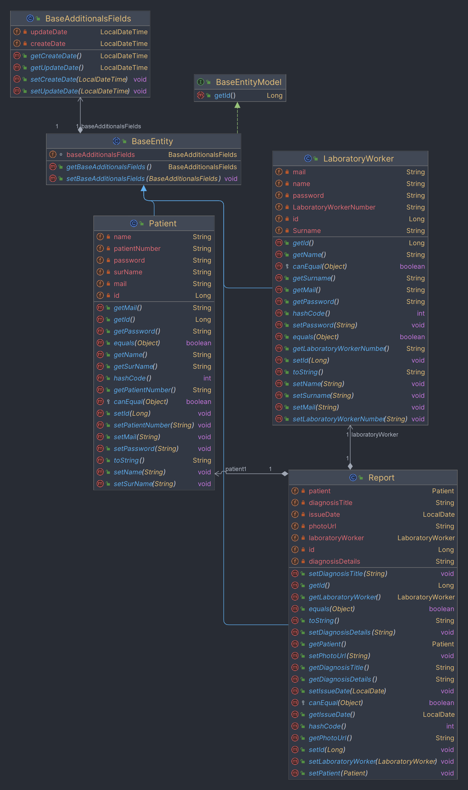
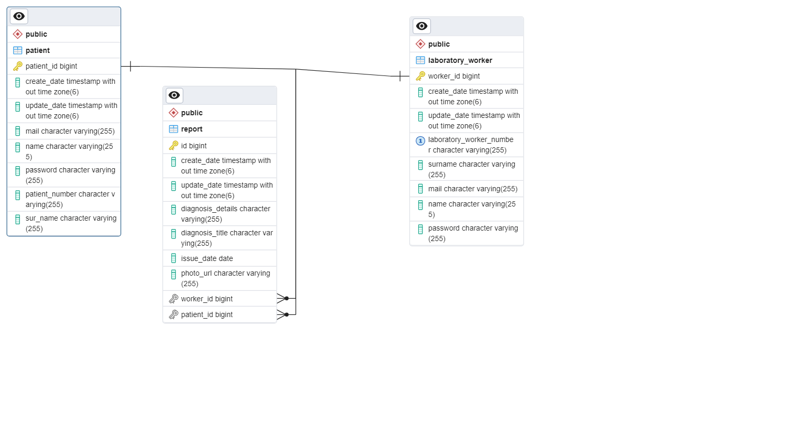

# Projeyi Çalıştırma

Bu projeyi çalıştırmak için aşağıdaki adımları izleyin:

## Adım 1: Docker imajını indirme

Projeyi çalıştırmak için öncelikle DockerHub'dan Docker imajını indirin:

```bash
docker pull demirrs/ozguryazilim
````
## Adım 2: Docker konteynerini başlatma
```bash
docker run -d --name labapp -p 8080:8080 demirrs/ozguryazilim
````
## Adım 3: Swagger UI'yi açma
Tarayıcınızda Swagger UI'yi açmak için aşağıdaki adrese gidin:

[Swagger UI](http://localhost:8080/swagger-ui/index.html#/)

 http://localhost:8080/swagger-ui/index.html#/

Burada tüm API'leri test edebilirsiniz.

# Laboratuvar Yönetim API

Bu API, laboratuvarlar, hastalar ve raporlar üzerinde işlemler gerçekleştirmek için kullanılır.

## Laboratory( Laboratuvar)

- `GET /api/v1/laboratory/{id}`: Belirli bir laboratuvarın bilgilerini almak için kullanılır.
- `POST /api/v1/laboratory`: Yeni bir laboratuvar oluşturmak için kullanılır.
- `PUT /api/v1/laboratory/{id}`: Mevcut bir laboratuvarın bilgilerini güncellemek için kullanılır.
- `DELETE /api/v1/laboratory/{id}`: Bir laboratuvarı silmek için kullanılır.

## Patient (Hastalar)

- `GET /api/v1/patient`: Tüm hastaların listesini almak için kullanılır.
- `GET /api/v1/patient/{id}`: Belirli bir hastanın bilgilerini almak için kullanılır.
- `POST /api/v1/patient/save`: Yeni bir hasta kaydı oluşturmak için kullanılır.
- `PUT /api/v1/patient/update/{id}`: Mevcut bir hastanın bilgilerini güncellemek için kullanılır.
- `DELETE /api/v1/patient/{id}`: Bir hastayı silmek için kullanılır.

## Report(Raporlar)

- `GET /api/v1/report/{id}`: Belirli bir raporun detaylarını almak için kullanılır.
- `POST /api/v1/report/save`: Yeni bir rapor oluşturmak için kullanılır.
- `PUT /api/v1/report/update/{id}`: Mevcut bir raporun bilgilerini güncellemek için kullanılır.
- `GET /api/v1/report/search/LaboratoryWorker/{laboratoryWorkerId}`: Bir laboratuvar çalışanına göre rapor aramak için kullanılır.
- `GET /api/v1/report/search/patient/{patientId}`: Bir hastaya göre rapor aramak için kullanılır.

## Hata Durumları

- 404 Not Found: Belirtilen ID'ye sahip kayıt bulunamadı.
- 400 Bad Request: İstek uygun formatta değil.


## Class Diagram


## ER Diagram


## NOT
Bu proje, kısıtlı bir zaman zarfında tamamlanmış olup Sezer Demir ve Ali Eray Akgül tarafından desteklenmiştir.
